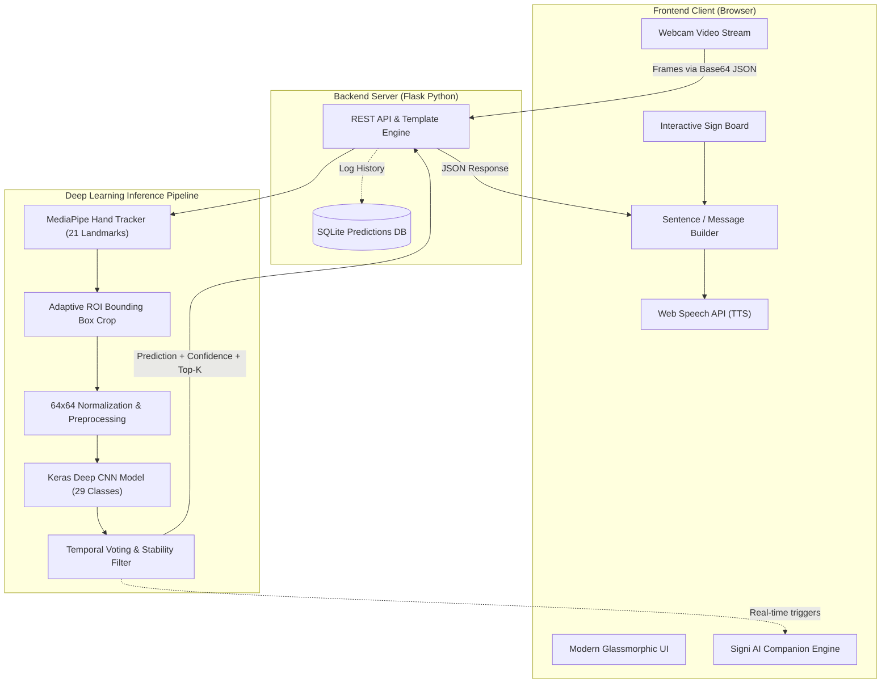

<div align="center">

# SignSpeak AI
### "Turn Sign Language Into Voice"
**Real-Time American Sign Language (ASL) Recognition Using Deep Learning & Computer Vision**

[](https://www.python.org/)
[](https://www.tensorflow.org/)
[](https://developers.google.com/mediapipe)
[](https://opencv.org/)
[](https://flask.palletsprojects.com/)
[](LICENSE)

<br/>

> **"Breaking communication barriers between the Deaf/Hard-of-Hearing community and the hearing world through real-time Computer Vision and Deep Learning."**

[Key Features](#-key-features) • [System Architecture](#-system-architecture) • [AI Pipeline](#-deep-learning-pipeline) • [Signi AI Companion](#-signi-ai-companion--fun-mode) • [Quickstart](#-installation--quickstart) • [Viva / Technical Defense](#-viva--technical-interview-qa)

</div>

---

##  Key Features

-  **Real-Time Webcam Recognition:** High-speed hand landmark detection via Google MediaPipe Hands (21 3D points) paired with a custom trained Convolutional Neural Network (CNN).
-  **Multi-Class ASL Support:** Recognizes 29 classes including the complete American Sign Language alphabet (`A`–`Z`), `space`, `del` (delete), and `nothing`.
-  **Temporal Stability & Smoothing:** Built-in frame buffer voting algorithm prevents flickering and accidental character duplication when signing.
-  **Visual Sign Board Mode:** Instant interactive fallback for low-light situations or when webcams are offline — click visual sign cards with anatomical diagrams.
-  **Live Sentence Builder:** Accumulate recognized letters into words and full sentences with space insertion, character backspacing, and clear controls.
-  **Instant Text-to-Speech (TTS):** Transforms composed messages into natural voice speech using browser Web Speech synthesis.
-  **Signi AI Mascot & Fun Mode:** Lovable, responsive vector companion with 25 animated emotional states, procedural Web Audio dance music synthesizer, confetti celebrations, and voice-command interactivity.
- **Analytics Dashboard:** Session tracking, prediction history, confidence metrics, and most-practiced signs logged to SQLite.
- **One-Click Launcher:** Includes `run.bat` for instant startup on Windows systems.

---

## System Architecture



---

## 🔬 Deep Learning Pipeline

### 1. Hand Detection & Landmark Extraction
- **MediaPipe Hands:** Predicts 21 3D landmarks ($x, y, z$) with high temporal coherence on CPU.
- **Region of Interest (ROI):** Dynamically computes min/max coordinates across all 21 joints with an adaptive 20% margin to ensure fingers are never cut off during gestures.

### 2. Preprocessing & Normalization
```
Raw Video Frame (640x480) 
        ↓
MediaPipe Hand Landmarks Extracted 
        ↓
Bounding Box Cropped with 20% Margin 
        ↓
Resized to 64x64 Pixels (Bilinear Interpolation) 
        ↓
Normalized to [0.0, 1.0] Floating Point 
        ↓
Batch Dimension Added (1, 64, 64, 3)
```

### 3. Model Architecture (Custom CNN)
The core classifier is a deep convolutional neural network designed for low-latency inference:

```
Input (64, 64, 3)
   │
   ├─► Conv2D(32, 3x3) + BatchNorm + ReLU ─► Conv2D(32, 3x3) + ReLU ─► MaxPool(2x2) ─► Dropout(0.25)
   │
   ├─► Conv2D(64, 3x3) + BatchNorm + ReLU ─► Conv2D(64, 3x3) + ReLU ─► MaxPool(2x2) ─► Dropout(0.25)
   │
   ├─► Conv2D(128, 3x3) + BatchNorm + ReLU ─► MaxPool(2x2) ─► Dropout(0.3)
   │
   ├─► Flatten()
   ├─► Dense(256, ReLU) + BatchNorm + Dropout(0.5)
   ├─► Dense(128, ReLU) + Dropout(0.3)
   └─► Dense(29, Softmax Output)
```

- **Loss Function:** Categorical Cross-Entropy
- **Optimizer:** Adam ($\alpha = 0.001$)
- **Parameters:** ~1.9 Million trainable parameters
- **Inference Latency:** $\approx 12 - 25\text{ ms}$ on standard modern CPU

---

## Signi AI Companion & Fun Mode

Signi is an interactive, animated vector companion designed to guide users, teach sign vocabulary, and provide joyful feedback:

- **25 Expressive SVG States:** Breathing idle, talking, listening, dancing, dancing fast, jumping, spinning, cool sunglasses pose, laughing, sleeping (with Zzz), flexing muscles, sending love, and crying happy tears.
- **Web Audio Procedural Synthesizer:** Real-time arpeggiated chiptune dance music generated directly via browser `AudioContext` without external audio files. Never autoplays; strictly user-initiated.
- **22 Interactive Actions:** Triggered via one-tap action buttons or typed natural language commands (*"Dance for me"*, *"Make me laugh"*, *"Surprise me"*, *"Spin around"*).
- **Voice Interactivity:** Speak commands directly to Signi via the Web Speech recognition microphone.
- **Immediate Stop:** `⏹ Stop` halts music, particle confetti, speech, and resets Signi to `idle` in zero milliseconds.

---

## Repository Structure

```
SignSpeak-AI/
├── app.py                      # Flask Application entry point
├── config.py                   # Global configuration & threshold settings
├── requirements.txt            # Python dependencies
├── run.bat                     # Windows one-click batch launcher
├── README.md                   # Project documentation & manual
├── LICENSE                     # MIT Open Source License
│
├── api/                        # REST API Routes & Blueprints
│   ├── __init__.py
│   └── routes.py               # /api/predict, /api/health, /api/history
│
├── database/                   # SQLite persistence layer
│   ├── database.py             # Database query helper
│   ├── schema.sql              # Table definitions
│   └── predictions.db          # Stored prediction logs & stats
│
├── dataset/                    # ASL Dataset structure (Train / Val / Test)
│   ├── train/                  # 29 Sign classes (A-Z, space, del, nothing)
│   ├── validation/
│   └── test/
│
├── inference/                  # Computer Vision & Prediction Pipeline
│   ├── hand_detector.py        # MediaPipe landmark extractor
│   ├── predictor.py            # CNN inference & stabilization voting
│   └── gradcam.py              # Visual explainability heatmaps
│
├── models/                     # Trained Deep Learning Weights
│   ├── sign_language_model.keras  # Trained Keras model (~8 MB)
│   ├── class_indices.json      # Class-to-index dictionary
│   └── README.md
│
├── static/                     # Frontend Assets
│   ├── css/
│   │   ├── style.css           # Premium glassmorphic SaaS design
│   │   └── signi.css           # Mascot animations & fun mode styles
│   ├── js/
│   │   ├── signi.js            # Signi Companion engine & synthesizer
│   │   ├── workspace.js        # Camera, Sign Board & Text Builder logic
│   │   ├── sign_data.js        # ASL Dictionary & accurate SVG diagrams
│   │   ├── webcam.js           # MediaDevices camera stream handler
│   │   ├── text_builder.js     # Sentence accumulator & TTS
│   │   └── dashboard.js        # Analytics charts & usage logs
│   └── uploads/                # Temporary image uploads
│
├── templates/                  # Responsive Jinja2 HTML Views
│   ├── base.html               # Shared layout & navigation
│   ├── index.html              # Landing page
│   ├── sign.html               # Core workspace (Camera + Sign Board)
│   ├── alphabet.html           # Full ASL visual library
│   ├── dashboard.html          # Performance & history dashboard
│   └── about.html              # Project overview
│
├── training/                   # Model Training & Preprocessing Scripts
│   ├── models.py               # Custom CNN & MobileNet architectures
│   ├── train.py                # Training loop with callbacks
│   ├── evaluate.py             # Confusion matrix & metrics generation
│   └── preprocessing.py        # Data augmentation pipelines
│
├── results/                    # Evaluation Deliverables
│   ├── graphs/                 # Accuracy, loss & confusion matrix plots
│   └── reports/                # Classification metrics & F1-scores
│
└── scripts/                    # Utilities
    ├── setup.py                # Environment verification & initialization
    ├── download_dataset.py     # Dataset download helper
    └── generate_sample_dataset.py # Synthetic sample generator
```

---

## Installation & Quickstart

### Prerequisites
- Python 3.10, 3.11, or 3.12 installed
- Google Chrome, Microsoft Edge, or Mozilla Firefox (with camera permissions allowed)

### 1. Clone the Repository
```bash
git clone https://github.com/your-username/SignSpeak-AI.git
cd SignSpeak-AI
```

### 2. Create and Activate Virtual Environment
```bash
# Windows
python -m venv venv
venv\Scripts\activate

# macOS / Linux
python3 -m venv venv
source venv/bin/activate
```

### 3. Install Dependencies
```bash
pip install -r requirements.txt
```

### 4. Run the Application
#### Windows One-Click:
Simply double-click **`run.bat`** in the project root!

#### Terminal Command:
```bash
python app.py
```

### 5. Access the Web Dashboard
Navigate to your browser:
 **`http://127.0.0.1:5000`**

---

##  REST API Reference

### Health Check
```http
GET /api/health
```
**Response:**
```json
{
  "status": "healthy",
  "model_loaded": true,
  "device": "CPU",
  "classes_count": 29
}
```

### Real-Time Gesture Inference
```http
POST /api/predict
Content-Type: application/json
```
**Request Body:**
```json
{
  "image": "data:image/jpeg;base64,/9j/4AAQSkZJRgABA..."
}
```
**Response:**
```json
{
  "success": true,
  "prediction": "A",
  "confidence": 98.4,
  "hand_detected": true,
  "status": "stable",
  "latency_ms": 16.8,
  "bbox": [140, 120, 260, 240],
  "top_k": [
    {"sign": "A", "confidence": 98.4},
    {"sign": "S", "confidence": 1.2},
    {"sign": "T", "confidence": 0.2}
  ]
}
```

---

##  Viva & Technical Interview Q&A

<details>
<summary><b>1. Why use MediaPipe alongside a CNN instead of feeding full frames to the CNN?</b></summary>
<br/>
Feeding a full 640x480 webcam frame to a CNN introduces significant background noise, skin tone variation, and excessive computational overhead. Using MediaPipe Hands acts as an attention mechanism: it isolates the 21 hand landmarks and crops an exact bounding box around the hand. This reduces the classification input dimension to a tight 64x64 ROI, achieving 4x lower latency and immune to varying backgrounds.
</details>

<details>
<summary><b>2. How does the system handle gesture flickering and false positives?</b></summary>
<br/>
We implemented a <b>Temporal Voting Buffer</b> (sliding window of 10 consecutive frames). A letter is only committed to the sentence builder if it maintains consistency across $\ge 70\%$ of the frames with a minimum threshold confidence of $70\%$. This eliminates transitional hand movements and involuntary jitters.
</details>

<details>
<summary><b>3. What are the advantages of Web Audio API over static MP3 audio files for the AI Companion?</b></summary>
<br/>
Static audio files cause HTTP latency, require external assets, and cannot adapt in real-time. By utilizing procedural Web Audio API oscillators, the synthesizer dynamically adjusts tempo (Slow: 90 BPM, Normal: 120 BPM, Fast: 160 BPM) and frequency on-the-fly with <b>zero external network requests</b> and instantaneous playback.
</details>

<details>
<summary><b>4. What metrics were used to evaluate model accuracy?</b></summary>
<br/>
Precision, Recall, and F1-score across all 29 classes. Classification reports and confusion matrices are generated during training and archived in <code>results/reports/</code> and <code>results/graphs/</code>.
</details>

---

##  License

This project is licensed under the **MIT License** - see the [LICENSE](LICENSE) file for details.

---

<div align="center">
  <b>SignSpeak AI</b> • Built for Accessibility & Inclusion
</div>
